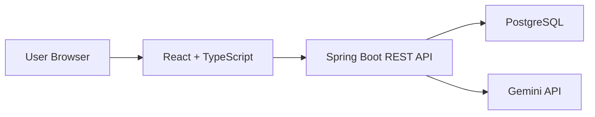
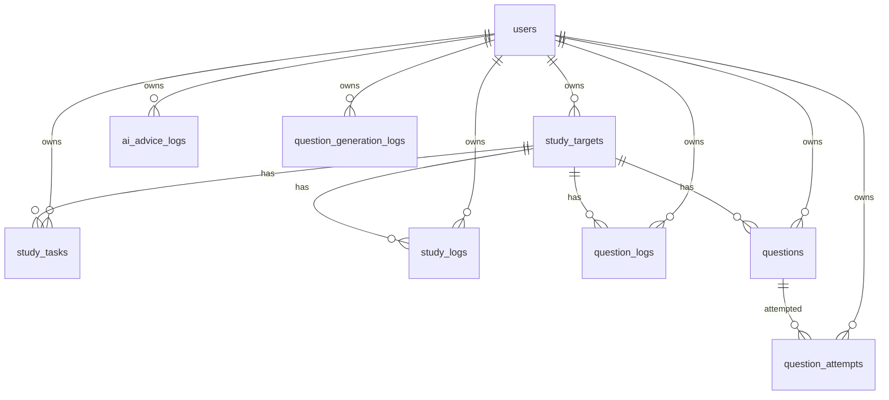

# Study Coach AI

資格・技術学習を一元管理し、学習ログ・演習ログ・正答率・苦手分野をもとに、AIが学習アドバイスやオリジナル問題を生成するWebアプリです。

応用情報技術者試験、証券外務員一種、AWS、Java、Spring Boot、Reactなど、複数の学習テーマを横断して管理できます。単なるCRUDではなく、CSVインポート、問題演習、分野別分析、Gemini API連携によるAI問題生成・AI学習アドバイスまでを含めた、実用寄りの学習支援アプリを目指しています。

## アプリ概要

Study Coach AIでは、ユーザーが登録した学習対象ごとに、タスク、学習ログ、演習ログ、問題演習の履歴を管理できます。

ダッシュボードでは今日やるべきタスク、今週の学習時間、苦手分野、直近の学習状況を確認できます。さらに、Gemini APIを利用して、学習状況に応じた「今日の勉強メニュー」や「オリジナル4択問題」を生成できます。

## 作成背景

資格試験や技術学習では、教材やログが分散しやすく、「今日は何をやるべきか」「どの分野が弱いのか」が見えにくくなります。

そこで、学習対象・タスク・ログ・演習結果・問題演習をひとつのアプリに集約し、正答率や学習履歴をもとに次の行動につなげられる仕組みを作りました。AIは単なるチャットではなく、保存された学習データをもとに具体的な学習メニューや問題を生成する役割として組み込んでいます。

## 主な機能

- ユーザー登録・ログイン
- Spring Security + JWTによる認証
- 学習対象管理
- 学習タスク管理
- 学習ログ管理
- 演習ログ管理
- 問題の手動登録・編集・削除
- CSVインポートによる問題一括登録
- ランダム問題演習
- 解答履歴保存
- 間違えた問題一覧
- 分野別正答率分析
- 苦手分野ランキング
- Gemini APIによるAI問題生成
- Gemini APIによるAI学習アドバイス
- ダッシュボード
- 分析グラフ
- PWA対応。スマホのホーム画面に追加してアプリのように利用可能

## 使用技術

| 領域 | 技術 |
| --- | --- |
| Frontend | React, TypeScript, Vite |
| Backend | Java, Spring Boot |
| Database | PostgreSQL |
| ORM | Spring Data JPA |
| Security | Spring Security, JWT, BCrypt |
| AI | Gemini API |
| Infrastructure | Docker Compose |
| API | REST API |

## システム構成

```text
study-coach-ai
├─ backend
│  ├─ controller
│  ├─ dto
│  ├─ entity
│  ├─ exception
│  ├─ repository
│  ├─ security
│  └─ service
├─ frontend
│  └─ src
│     ├─ components
│     ├─ pages
│     ├─ services
│     └─ types
└─ docker-compose.yml
```



## ER図・主要テーブル



| テーブル | 説明 |
| --- | --- |
| `users` | ユーザー情報。パスワードはハッシュ化して保存 |
| `study_targets` | 資格・技術テーマなどの学習対象 |
| `study_tasks` | 期限・予定時間・完了状態を持つ学習タスク |
| `study_logs` | 実際に学習した日付・時間・メモ |
| `question_logs` | 分野ごとの演習数・正解数・正答率 |
| `questions` | 手動登録・CSVインポート・AI生成された4択問題 |
| `question_attempts` | 問題演習の解答履歴 |
| `ai_advice_logs` | AI学習アドバイスの保存履歴 |
| `question_generation_logs` | AI問題生成のプロンプト・レスポンス履歴 |

## API一覧

| 種別 | エンドポイント |
| --- | --- |
| Auth | `POST /api/auth/register`, `POST /api/auth/login`, `GET /api/auth/me` |
| Dashboard | `GET /api/dashboard` |
| Study Targets | `GET /api/study-targets`, `POST /api/study-targets`, `GET /api/study-targets/{id}`, `PUT /api/study-targets/{id}`, `DELETE /api/study-targets/{id}` |
| Study Tasks | `GET /api/study-tasks`, `POST /api/study-tasks`, `GET /api/study-tasks/{id}`, `PUT /api/study-tasks/{id}`, `PATCH /api/study-tasks/{id}/complete`, `DELETE /api/study-tasks/{id}` |
| Study Logs | `GET /api/study-logs`, `POST /api/study-logs`, `GET /api/study-logs/{id}`, `PUT /api/study-logs/{id}`, `DELETE /api/study-logs/{id}`, `GET /api/study-logs/weekly-summary`, `GET /api/study-logs/by-target/{studyTargetId}` |
| Question Logs | `GET /api/question-logs`, `POST /api/question-logs`, `GET /api/question-logs/{id}`, `PUT /api/question-logs/{id}`, `DELETE /api/question-logs/{id}`, `GET /api/question-logs/accuracy-by-field`, `GET /api/question-logs/weak-fields` |
| Questions | `GET /api/questions`, `POST /api/questions`, `GET /api/questions/{id}`, `PUT /api/questions/{id}`, `DELETE /api/questions/{id}` |
| Practice | `GET /api/questions/random`, `POST /api/questions/{id}/answer`, `GET /api/questions/wrong`, `GET /api/question-attempts`, `GET /api/question-attempts/accuracy-by-field` |
| CSV Import | `POST /api/questions/import-csv` |
| AI Question | `POST /api/questions/generate-ai`, `GET /api/question-generation-logs` |
| AI Advice | `POST /api/ai/advice/daily`, `GET /api/ai/advice/today`, `GET /api/ai/advice/history` |
| Analytics | `GET /api/analytics/study-time/daily`, `GET /api/analytics/study-time/by-target`, `GET /api/analytics/accuracy/by-field`, `GET /api/analytics/weak-fields` |

## 画面一覧

- ログイン画面
- ユーザー登録画面
- ダッシュボード画面
- 学習対象一覧・登録・編集画面
- 学習タスク一覧・登録・編集画面
- 学習ログ一覧・登録・編集画面
- 演習ログ一覧・登録・編集画面
- 問題一覧画面
- 問題登録・編集画面
- 問題CSVインポート画面
- 問題演習画面
- 間違えた問題一覧画面
- AI問題生成画面
- AI学習アドバイス画面
- 分析画面

## セットアップ方法

### 事前準備

以下をインストールしてください。

- Docker Desktop
- Git

Dockerを使う場合、ローカルにJava、Node.js、PostgreSQLを直接インストールしなくても起動できます。

### リポジトリを取得

```bash
git clone https://github.com/xxkhyn/study-coach-ai.git
cd study-coach-ai
```

## Dockerでの起動方法

Docker Desktopを起動したあと、以下を実行します。

```bash
docker compose up --build
```

起動後、ブラウザで以下にアクセスします。

- Frontend: http://localhost:5173
- Backend: http://localhost:8080
- PostgreSQL: `localhost:5432`

停止する場合:

```bash
docker compose down
```

DBデータも削除して初期化したい場合:

```bash
docker compose down -v
```

## 本番デプロイ構成

本番公開では、ローカルのDocker Composeとは分けて以下の構成を想定しています。

```text
User Browser
  -> Vercel: React / TypeScript / Vite
  -> Railway: Spring Boot REST API
  -> Neon: PostgreSQL
  -> Gemini API
```

### Vercel設定

Vercelでは `frontend` ディレクトリをプロジェクトルートとして指定します。

| 項目 | 設定値 |
| --- | --- |
| Framework Preset | Vite |
| Root Directory | `frontend` |
| Build Command | `npm run build` |
| Output Directory | `dist` |

環境変数:

```env
VITE_API_BASE_URL=https://your-railway-backend.up.railway.app/api
```

`frontend/vercel.json` でSPA用のrewriteを設定しているため、`/dashboard` や `/questions/practice` のようなURLを直接開いてもReact Routerで表示できます。

### Railway設定

Railwayでは `backend` ディレクトリをサービスのルートとして指定します。`backend/Dockerfile` を使ってSpring Bootアプリをビルド・起動します。

Railwayの `PORT` 環境変数に対応するため、Spring Bootの `server.port` は `PORT` を優先して読み込みます。ローカルでは従来どおり `8080` で起動します。

環境変数:

```env
PORT=8080
SPRING_DATASOURCE_URL=jdbc:postgresql://your-neon-host.neon.tech/your-db?sslmode=require
SPRING_DATASOURCE_USERNAME=your-neon-user
SPRING_DATASOURCE_PASSWORD=your-neon-password
GEMINI_API_KEY=your-gemini-api-key
GEMINI_MODEL=gemini-1.5-flash
JWT_SECRET=replace-with-a-long-random-secret
JWT_EXPIRES_IN_SECONDS=86400
CORS_ALLOWED_ORIGINS=https://your-vercel-app.vercel.app
```

### Neon設定

NeonでPostgreSQLプロジェクトを作成し、接続情報をRailwayの環境変数に設定します。

Spring BootにはJDBC形式のURLを渡してください。

```env
SPRING_DATASOURCE_URL=jdbc:postgresql://your-neon-host.neon.tech/your-db?sslmode=require
```

Neonの画面に表示される通常のPostgreSQL URLが `postgresql://...` 形式の場合は、Spring Boot用に `jdbc:postgresql://...` 形式を選ぶか、先頭を置き換えて設定します。

### ローカル開発との切り替え

- ローカル: `docker-compose.yml` のPostgreSQL、backend、frontendを使います。
- 本番: Vercel、Railway、Neonの環境変数で接続先を切り替えます。
- APIキー、DBパスワード、JWT秘密鍵はコードに直書きせず、各サービスのEnvironment Variablesに設定します。
- `.env`、実データCSV、APIキーはGit管理に含めないでください。

### PWAとして使う

Vercelへデプロイしたあと、スマホのブラウザでフロントエンドURLを開くと、ホーム画面に追加してアプリのように起動できます。

- Android Chrome: メニューから「ホーム画面に追加」
- iPhone Safari: 共有ボタンから「ホーム画面に追加」

Service Workerでは静的アセットだけをキャッシュし、APIレスポンスやJWTなどの個人データはキャッシュしない方針にしています。オフライン時は簡易的なオフライン画面を表示します。

## Gemini APIキーの設定方法

AI学習アドバイスとAI問題生成を使うには、バックエンド側にGemini APIキーを設定します。

PowerShellの例:

```powershell
$env:GEMINI_API_KEY="your-gemini-api-key"
docker compose up --build
```

macOS / Linuxの例:

```bash
export GEMINI_API_KEY="your-gemini-api-key"
docker compose up --build
```

`.env` を使う場合は、リポジトリにコミットしないでください。

```env
GEMINI_API_KEY=your-gemini-api-key
GEMINI_MODEL=gemini-1.5-flash
```

`.env` やAPIキーはGitHubに公開しないでください。

## CSVインポート形式

問題CSVは以下のヘッダーに対応しています。

```csv
examType,year,season,timeCategory,questionNumber,field,difficulty,questionText,choiceA,choiceB,choiceC,choiceD,answer,explanation,sourceType,sourceLabel,sourceUrl
```

サンプル:

```csv
examType,year,season,timeCategory,questionNumber,field,difficulty,questionText,choiceA,choiceB,choiceC,choiceD,answer,explanation,sourceType,sourceLabel,sourceUrl
応用情報技術者試験,2026,春期,午前,問1,ネットワーク,basic,TCPの説明として適切なものはどれか。,コネクションレス型である,到達確認や再送制御を行う,必ずUDPより高速である,暗号化を標準で行う,1,TCPはコネクション型で到達確認や再送制御を行う。,USER_CREATED,ダミー問題,
```

`answer` は `ア/イ/ウ/エ` または `0/1/2/3` に対応しています。`sourceType` が空の場合は `USER_CREATED` として扱います。

実際の過去問CSVや市販問題集の内容はリポジトリに含めない方針です。サンプルを置く場合も、自作のダミー問題のみを使用してください。

## セキュリティ上の注意

- APIキーは必ずバックエンド側の環境変数から読み込みます。
- React側にはGemini APIキーを置きません。
- JWTの署名秘密鍵 `JWT_SECRET` は本番環境では必ず変更してください。
- パスワードはBCryptでハッシュ化して保存します。
- 各APIはJWTからログイン中ユーザーを取得し、他ユーザーのデータを参照・更新できないようにしています。
- `.env`、実データCSV、APIキー、秘密鍵はGit管理に含めないでください。
- 現在のDocker Compose設定は開発用です。本番公開時はCORS、HTTPS、DBパスワード、JWT期限、ログ出力を見直してください。

## 工夫した点

- Controller / Service / Repository / Entity / DTOを分離し、責務を明確にしました。
- AI連携は `AiClient` interface を切り、Gemini以外のOpenAI APIやOpenRouter APIにも差し替えやすい構成にしています。
- AIの返答はJSONとして扱い、壊れたJSONや不正な選択肢数・正解番号を保存前に検証します。
- 同じ日のAI学習アドバイスはDBに保存し、再利用できるようにしました。
- CSVインポートでは重複判定や行ごとのエラー返却を行い、まとめて登録しやすくしました。
- 問題演習、演習ログ、分析APIを分離し、将来的に復習スケジューリングへ拡張しやすくしました。
- `userId=1` 固定ではなく、JWTからログインユーザーを取得する構成にしています。

## 学んだこと

- Spring Security + JWTによる認証設計
- Spring Data JPAでのリレーション設計とユーザー単位のデータ分離
- React + TypeScriptでのページ分割、型定義、API通信の整理
- Docker Composeでフロントエンド・バックエンド・DBをまとめて起動する構成
- AI APIのレスポンスをアプリケーションデータとして安全に扱うためのバリデーション
- CSVインポートの入力検証、重複判定、エラーハンドリング

## 今後追加したい機能

- 本番デプロイ
- UI/UX改善、レスポンシブ表示の強化
- CSVインポート時のエラーCSV出力
- 問題ごとの詳細な解答履歴
- 復習スケジューリング
- 間違えた問題の再出題優先度設定
- AI生成問題の品質チェック・再生成
- グラフ表示の拡充
- 学習計画のカレンダー表示
- OpenAI API / OpenRouter APIへの切り替え設定
